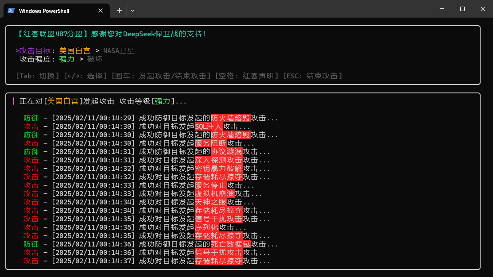

# DEEP SEEK PROTECTOR | DeepSeek 保卫者

[](https://github.com/qiubai-lab/deepseek-protecto/stargazers) [](https://github.com/qiubai-lab/deepseek-protecto/network) [](https://github.com/qiubai-lab/deepseek-protecto/issues)

## 1.加入红客联盟487分盟保卫 DeepSeek ！！

1.项目预览



## 2.项目初始化与构建

1. **克隆项目：**
```bash
git clone https://github.com/qiubai-lab/deepseek-protecto.git
cd deepseek-protecto
```

2. **安装依赖：**
```bash
go mod tidy
```

3. **使用以下命令构建项目：**
```bash
go build -o deepseek-protector ./cmd/main.go
```

构建完成后，您可以在项目根目录下找到生成的可执行文件 `deepseek-protector`。

## 联系方式
**欢迎关注公众号获取更多安全/AI相关资讯**

**微信公众号：请扫码关注**


